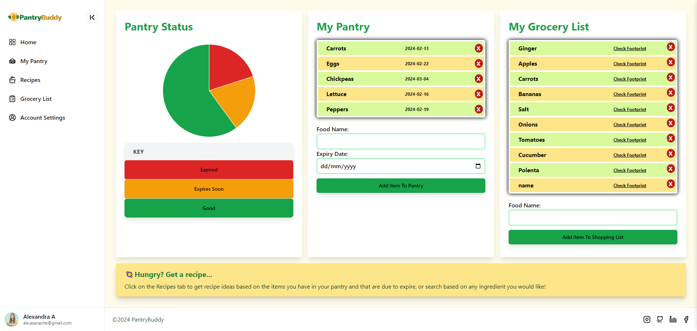
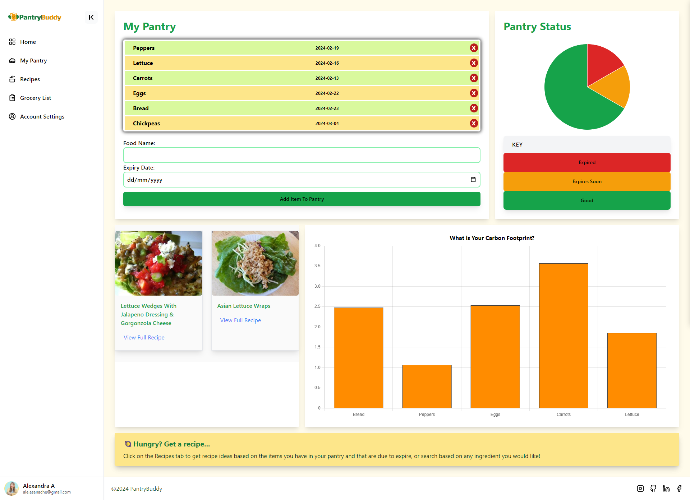

# Pantry Buddy 🥪

## Deployed Website Link
https://pantry-buddy.netlify.app/

## Description
A website to keep track of food in a pantry, get recipe ideas with the items which are closest to expiry and monitor how food affects carbon footprint.

## Installation
N/A

## Usage
When the user enters the landing page, they can learn more about the app and sign up or log in into their accounts.

Once logged in on their accounts, they can see their Dashboard Home, which displays both the Pantry List and Pantry Status, as well as the Grocery List.

On the My Pantry page, users can add more items to their pantry, along with the expiry date and see the status of their pantry in the pie chart widget. Underneath, they automatically get two recipe suggestions based on the item that is going off the soonest in their pantry. To the right, they can see the carbon footprint for each item in the pantry. 

On the Recipes page, the users can see more recipe suggestions when searching by item, and then add items to their grocery list in the Grocery List page. When clicking on 'Check footprint' next to each item in the grocery list, users can see the carbon footprint.

On the Account Settings page, users can personalise their account by adding a profile image and a username.

## Credits 
Overall instruction and provision of necessary materials for this project from the EdX Front-End Web Development Bootcamp instructor and teaching assistants (Oct2023 Cohort).

Additionally, the following resources helped us by providing the necessary tools or instructions to complete this task:
- Major help for sidebar component: https://www.youtube.com/watch?v=NFrFhBJPTmI ; https://tailwindui.com/components/application-ui/navigation/sidebar-navigation https://tailwindcss.com/ ;
- Footer inspiration: https://www.material-tailwind.com/docs/react/footer
- Picking brand colours: https://tailwindcss.com/docs/customizing-colors
- Git flow & branches revision: https://www.theserverside.com/blog/Coffee-Talk-Java-News-Stories-and-Opinions/git-push-new-branch-remote-github-gitlab-upstream-example
- All things Lucide React: https://lucide.dev/guide/
- Image for Jumbotron: https://unsplash.com/photos/green-chili-peppers-and-yellow-bell-pepper-ezYZfFnzARM
- NavBar Inspiration: https://www.youtube.com/watch?v=74ys-dT94mA
- Website copy and example reviews: ChatGPT
- Example reviews user images: https://www.unrealperson.com/  

Badges at the bottom of this README file were listed with the help of the following repository: https://github.com/Ileriayo/markdown-badges

## License

MIT License

Copyright (c) 2024 Ajaya Bhogal-Todd, Alexandra Asanache, Dean Waring, and Senami Ahifon (EdX Front-End Web Development Bootcamp - Oct2023 Cohort)

Permission is hereby granted, free of charge, to any person obtaining a copy
of this software and associated documentation files (the "Software"), to deal
in the Software without restriction, including without limitation the rights
to use, copy, modify, merge, publish, distribute, sublicense, and/or sell
copies of the Software, and to permit persons to whom the Software is
furnished to do so, subject to the following conditions:

The above copyright notice and this permission notice shall be included in all
copies or substantial portions of the Software.

THE SOFTWARE IS PROVIDED "AS IS", WITHOUT WARRANTY OF ANY KIND, EXPRESS OR
IMPLIED, INCLUDING BUT NOT LIMITED TO THE WARRANTIES OF MERCHANTABILITY,
FITNESS FOR A PARTICULAR PURPOSE AND NONINFRINGEMENT. IN NO EVENT SHALL THE
AUTHORS OR COPYRIGHT HOLDERS BE LIABLE FOR ANY CLAIM, DAMAGES OR OTHER
LIABILITY, WHETHER IN AN ACTION OF CONTRACT, TORT OR OTHERWISE, ARISING FROM,
OUT OF OR IN CONNECTION WITH THE SOFTWARE OR THE USE OR OTHER DEALINGS IN THE
SOFTWARE.

## Badges
**Bootcamp Project:** 

**Languages & Frameworks:**        

**Project Tools:** 	  	     

**Deployment:** 
